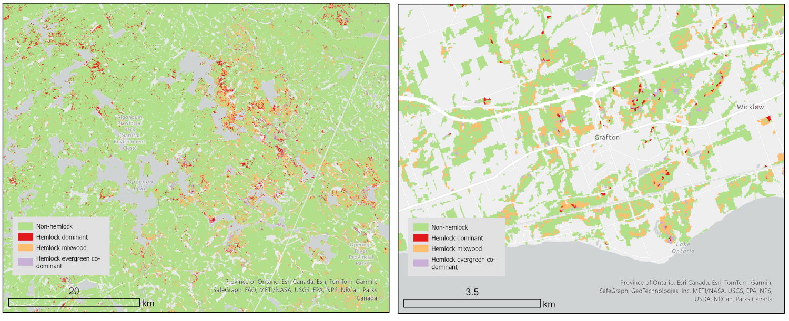

Developing an inventory of Eastern hemlock for Ontario
------------------------------------------------------

The goal of this project was to develop a classifier for Eastern hemlock in Ontario forests. The classifier is based on 20-m resolution Sentinel-2 imagery provided by the European Space Agency via the Google Earth Engine.

The final classification is provided in the "HemlockWoodedAreaMask.tif" file. The class codes are as follows:  
0 - Non-hemlock forested  
1 - Dominant hemlock  
2 - Hemlock / Deciduous co-dominant  
3 - Hemlock / Evergreen co-dominant  

<figure>
  
  <figcaption>Examples of classified hemlock in Algonquin Provincial Park (left) and Grafton, Ontario (right).</figcaption>
</figure>

The classification was carried out according to the following workflow:

1. Generated and downloaded 10-day median composites of the Infrared Enhanced Chlorophyll Index (IRECI) from all available Sentinel-2 images over a given Sentinel-2 tile ID from the Google Earth Engine. IRECI is defined as:

$$\frac{RE3-R}{\frac{RE1}{RE2}}$$

where RE3 is the third red-edge band, R is the red band, RE1 is the first red-edge band, and RE2 is the second red-edge band included on the Sentinel-2 Multi-Spectral Imager (MSI) sensor.

2. Generate 10-day composites from the IRECI time series by taking the median pixel value for all images acquired within defined 10 day-of-year compositing windows.

3. Train a tree species classifier using data acquired from the SilvEcon Hemlock database and the Ontario Forest Resources Assessment.

4. Rasterize the Wooded Area vector product by Land Information Ontario to a 20-m Sentinel-2 pixel grid and apply it to the classified raster to isolate forested pixels. 

5. Aggregate non-hemlock and hemlock classes to obtain a hemlock classified raster with the following classes: (0) Non-hemlock (1) Dominant hemlock; (2) Hemlock-deciduous co-dominant; (3) Hemlock-evergreen co-dominant.

## Data Sources

Hemlock Database used with permission from SilvEcon Ltd. and original data contributors:  
- Grand River Conservation  
- Halton Region Conservation   
- Maitland Conservation   
- Grey Sauble Conservation  
- Hamilton Conservation Authority  
- County of Simcoe  
- York Region  
- Credit Valley Conservation  
- County of Lennox and Addington  

Wooded Area vector product obtained from Land Information Ontario. https://geohub.lio.gov.on.ca/datasets/lio::wooded-area/about

Additional tree species data obtained from the Ontario Forest Resources Inventory. https://www.ontario.ca/page/forest-resources-inventory  
